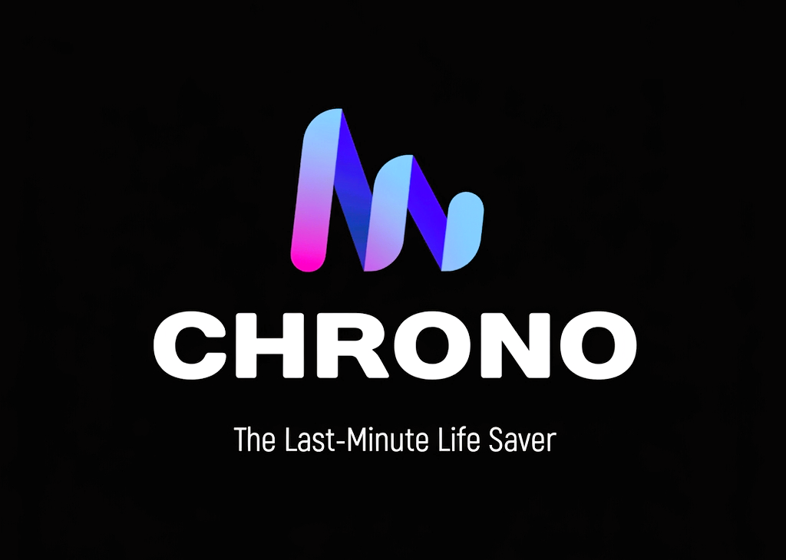

<div align="center">
  

  <br />
  <br />
  
# ⏳ Chrono: The Autonomous AI Productivity Ecosystem
  
  **An agentic, context-aware productivity engine that proactively plans, prioritizes, and executes task tracks before deadlines pass.**
  
  [](https://chrono-1033583129131.asia-southeast1.run.app)
  [](https://blockseblock.com/dashboard)

  <br />

  <div>
    
    
    
    
    
    
    
    
    
  </div>

  <br />

  <!-- 🎥 Optional: If you want to include your workflow walk-through recording GIF, link it right here -->
  <!--  -->

</div>

---

## 🚀 Live Demo & Evaluator Instructions

* **Live Cloud Service Link:** [https://chrono-1033583129131.asia-southeast1.run.app](https://chrono-1033583129131.asia-southeast1.run.app)
* **Code Repository Link:** [https://github.com/Prithwish-18/Chrono](https://github.com/Prithwish-18/Chrono)

### ⚠️ IMPORTANT: Google Calendar Testing Instructions
You are welcome to register and use your own email address to test the core dashboard (Tasks, AI Planner, Chrono-Coach, Pomodoro, Daily Goals, and Voice Notes).

However, because the Google Calendar API is currently in "Testing" mode under Google Cloud OAuth constraints, **you MUST use the following pre-whitelisted credentials if you wish to test the live Google Calendar Synchronization feature:**

* **Email:** `vibe2ship.test@gmail.com`
* **Password:** `Vibe2shiptest@1234`

*(If you attempt to connect the Calendar API with a non-whitelisted email, Google will return an `Error 403: access_denied` screen).*

### 🔔 Enabling Notifications
On first login, Chrono will prompt you to enable browser notifications. Accept the prompt to receive sound-based reminders as your task deadlines approach — this works even if the Chrono tab is unfocused, as long as the browser remains open.

### 📍 Location & Weather
Chrono requests browser location access on load to show your live local weather, city name, and correct local time in the hero banner. If location access is denied, it gracefully falls back to displaying Kolkata's weather and time as a default.

---

## 🎯 Problem Statement

**The Last-Minute Life Saver**
Students, professionals, and entrepreneurs frequently miss deadlines, assignments, meetings, and important commitments. Existing productivity tools often rely on passive reminders that are easy to ignore and do little to help users actually complete their tasks.

**The Chrono Solution:**
Chrono moves beyond traditional static reminders. It is a context-aware application that acts as a proactive productivity companion. By leveraging semantic AI reasoning, Chrono transforms unorganized, anxiety-inducing task lists into structured, actionable hourly roadmaps synchronized directly to a user's real-world timeline — and now actively pushes sound-based alerts so nothing slips through unnoticed.

---

## ✨ Key Features

* 🎙️ **Voice-Automated Task Capturing:** Native Web Speech API integration allowing users to dictate tasks, details, and complex situations hands-free.
* 🎧 **Voice Notes Journal:** A dedicated recording panel where users can capture, store, and replay short voice memos over time — recorded directly in-browser and synced per-user via Firestore, no external audio service required.
* 🧠 **Intelligent Task Prioritization:** A Gemini-powered engine that analyzes task deadlines and importance to dynamically re-sequence daily agendas.
* 🤖 **Chrono-Coach (Conversational Mentor):** An interactive sidebar coach that parses real-time stress scenarios, drafts markdown-formatted strategies, and allows users to inject actionable planner blocks directly into their dashboard with a single tap.
* 📅 **One-Tap Google Calendar Sync:** Translates AI-generated daily schedules and task complexity estimates into precise 24-hour timestamp blocks, securely writing them to the user's Google Calendar.
* 🔔 **Sound-Based Deadline Notifications:** A dedicated reminder engine watches every task's deadline in real time and triggers a browser notification plus an audible two-tone chime (synthesized natively via the Web Audio API) as a task approaches or becomes overdue — so reminders are heard, not just seen.
* 🌍 **Live Geolocation-Aware Dashboard:** Automatically detects the user's real location via the Geolocation API and reverse-geocodes it to display accurate local weather, city name, and local time for every visitor — no more hardcoded defaults.
* 📱 **Fully Responsive Bento Layout:** The entire dashboard, navigation bar, hero banner, and every feature panel now adapt cleanly across mobile, tablet, and desktop breakpoints.
* 🍅 **Procedural Pomodoro Suite:** A highly reliable focus timer featuring triangle-wave synthesized audio chimes built natively with the Web Audio API to guarantee 100% execution reliability.
* 🔥 **Gamified Consistency Tracking:** Real-time Firestore-backed streak tracking, level progression, and an 84-day visual consistency heatmap for habit building.

---

## 🏗️ Technical Architecture & Google Integration

This project was engineered for high performance, utilizing a modern decoupled stack:

### Frontend & UI
* **React 19 & TypeScript:** Strongly typed, component-driven UI architecture.
* **Tailwind CSS v4 & Framer Motion:** Fluid, responsive bento-grid layouts with seamless overlay transitions, fully adapted for mobile-first breakpoints.

### Backend & Database
* **Express.js (Node.js):** Lightweight backend routing and API management.
* **Firebase Core:** Real-time `Firestore` synchronization and `Firebase Auth` security gates — now also backing the Voice Notes journal via base64-encoded audio documents scoped per user.

### Browser-Native APIs
* **Geolocation API:** Detects the user's coordinates client-side, reverse-geocoded via a free BigDataCloud lookup to resolve a human-readable city name — cached per session to avoid repeated permission prompts.
* **Notification API + Web Audio API:** Powers the deadline reminder system — a background watcher checks task deadlines against the current time and fires a native browser notification paired with a synthesized two-tone audio chime, with no external sound file dependency.
* **MediaRecorder API:** Captures in-browser microphone audio for the Voice Notes feature, encoding recordings as base64 and persisting them to Firestore per user.

### Google Technologies Utilized
* **Google Cloud Run:** Fully containerized production deployment.
* **Google Identity Services (OAuth 2.0):** Secure, token-based authentication for Google APIs.
* **Google Calendar API:** Two-way read/write capabilities for live scheduling.
* **GoogleGenAI SDK (Gemini):** Advanced AI reasoning logic.

### 🛡️ AI Fallback & Resilience Strategy
To ensure the application remains functional during hackathon evaluation traffic spikes or transient network issues, Chrono implements a **Multi-Stage AI Fallback Architecture**:
1. Attempts the primary configured Gemini model for high-speed reasoning.
2. Automatically routes to a secondary or tertiary model upon encountering `503` or `429` (Rate Limit) errors.
3. Utilizes exponential backoff algorithms and localized procedural processing (falling back to strict chronological/alphabetical sorting) if external APIs become completely unavailable.

---

## 💻 Local Setup & Installation

If you wish to run Chrono locally, follow these steps:

**1. Clone the repository:**
```bash
git clone https://github.com/Prithwish-18/Chrono.git
cd Chrono
```

**2. Install dependencies:**
```bash
npm install
```

**3. Configure environment variables:**
```bash
cp .env.example .env
```
Fill in `.env` with your own `GEMINI_API_KEY`, `VITE_GOOGLE_CLIENT_ID`, and Firebase project credentials in `src/firebase.ts`.

**4. Run in development:**
```bash
npm run dev
```

**5. Build and run in production:**
```bash
npm run build
npm start
```

### Browser Permissions Required Locally
Several features rely on browser permission prompts — grant these when running locally to test the full experience:
* **Location access** — for the live weather/time hero banner
* **Microphone access** — for Voice Notes and voice-dictated tasks
* **Notification access** — for sound-based deadline reminders

All three require the app to be served over `HTTPS` or `localhost` — both satisfied automatically in local development and on the Cloud Run deployment.

---

## 📁 Project Structure

```
Chrono/
├── server.ts                        # Express backend — Gemini API routes
├── index.html                       # Entry point + Google Identity Services script
├── src/
│   ├── App.tsx                      # Main app shell, panel routing, notification bell
│   ├── firebase.ts                  # Firebase config + initialization
│   ├── types.ts                     # Shared TypeScript interfaces
│   ├── components/
│   │   ├── AuthGate.tsx             # Login / Register
│   │   ├── HeroBanner.tsx           # Geolocation-aware clock, weather, theme
│   │   ├── TodoListPanel.tsx        # AI-prioritized task list
│   │   ├── DailyPlannerPanel.tsx    # AI-generated daily schedule
│   │   ├── DailyGoalsPanel.tsx      # Streaks, heatmap, points, levels
│   │   ├── PomodoroPanel.tsx        # Focus timer + voice control
│   │   ├── MotivationPanel.tsx      # Daily quotes
│   │   ├── ProductivityCoach.tsx    # Conversational AI assistant
│   │   ├── CalendarPanel.tsx        # Google Calendar dashboard
│   │   ├── VoiceNotesPanel.tsx      # Record, store, and replay voice memos
│   │   └── MicButton.tsx            # Reusable voice input button
│   ├── gcal/
│   │   └── GCalContext.tsx          # Google Calendar OAuth + API context
│   └── hooks/
│       ├── useSpeechRecognition.ts  # Web Speech API hook
│       ├── useGeolocation.ts        # Browser geolocation + reverse geocoding
│       ├── useNotifications.ts      # Notification API + Web Audio chime
│       └── useTaskReminders.ts      # Watches Firestore tasks for due deadlines
└── package.json
```

---

## 🗺️ Roadmap

- [x] Core AI productivity features (prioritize, schedule, suggest, coach)
- [x] Google Calendar two-way integration
- [x] Voice-enabled task and goal input
- [x] Goal tracking with streaks and heatmap
- [x] Firebase Auth + real-time Firestore sync
- [x] Production deployment on Google Cloud Run
- [x] Geolocation-aware weather and local time
- [x] Mobile-responsive layout across all panels
- [x] Voice Notes journal panel
- [x] Sound-based deadline notifications
- [ ] Publish OAuth consent screen for public Calendar access
- [ ] Migrate Voice Notes storage from base64 Firestore documents to Firebase Storage for longer recordings
- [ ] Background push notifications via Service Worker (beyond tab-open reminders)

---

## 👤 Team

**Built by Prithwish** for VIBE2SHIP — Coding Ninjas × Google for Developers Hackathon

[GitHub](https://github.com/Prithwish-18) · [Live App](https://chrono-1033583129131.asia-southeast1.run.app)

---

<div align="center">

**Built with 🔥 using Google AI Studio, Gemini API, and Google Cloud Run**

</div>
